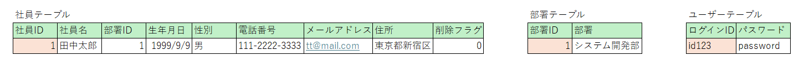
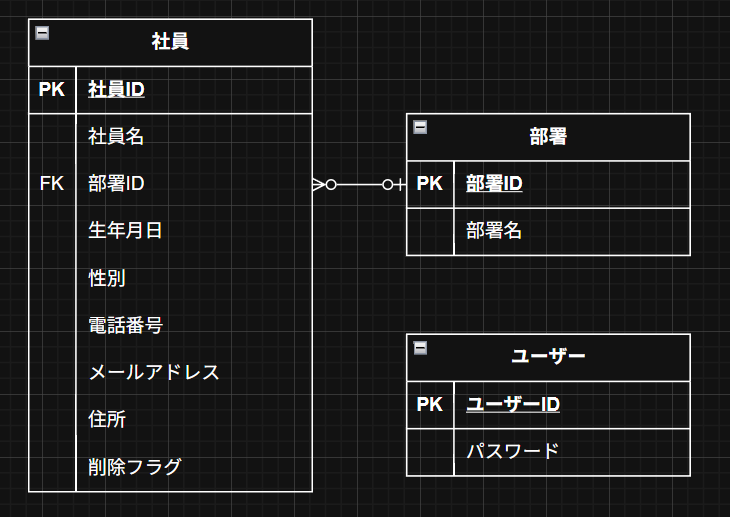
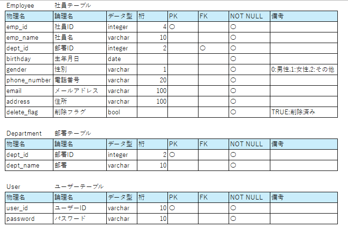

# csharp_training_202605
Web開発演習

## 進捗
### 5/20
- スケジュール立案
- 要件定義
- 設計  
  - ER図：完成
  - クラス図：途中まで

### 5/21
- 設計
  - クラス図：完成
  - シーケンス図：完成
  - テストケース：要修正
  - テーブル定義書：完成  

☆ログイン機能は後日加筆予定

### 5/22
- 設計
  - テストケース：完成
- 実装
  - 社員一覧表示機能：途中

## 社員情報管理システム
社員情報と部門情報の管理を行う。
人事部など管理者用のシステム。
### 機能
- ログイン/ログアウト：ユーザ認証を行う
  - ユーザ認証できた人のみ他の機能を利用できる
- 社員一覧：登録されている社員全員を一覧形式で表示する
- 社員登録：社員を新規登録する
  - 新入社員などの登録をする
- 社員更新：登録されている社員の情報を変更する
  - 部署異動、名字の変更などに対応する
- 社員削除：登録されている社員の情報を削除する
  - 社員の退社に対応
  - 削除フラグで管理しデータベースからは完全に削除しない
- 部門一覧：登録されている部門を一覧形式で表示する
- 部門登録：部門を新規登録する
- 部門更新：登録されている部門の情報を変更する
  - 部署名変更など
- 部門削除：登録されている部門を削除する
  - その部門にいた社員は部門未登録となる
  - 削除フラグは使用せずデータベースから完全に削除する

## スケジュール
### 5/20
- スケジュール立案
- 要件定義
- 設計  
  - テーブル定義書
  - クラス図

### 5/21
- 設計
  - クラス図(2h)
  - シーケンス図(1.5h)
  - テストケース(1.5h)
- ~~実装(1h)~~
  - ~~環境構築~~
  - ~~データベース~~
  - ~~アプリケーション層~~
    - ~~ドメインオブジェクト~~
    - ~~Adapter~~
    - ~~Repository~~

### 5/22

- **実装(5/21未完了分)**
  - **環境構築**
  - **データベース**
  - **アプリケーション層**
    - **ドメインオブジェクト**
    - **Adapter**
    - **Repository**
- 実装
  - インフラストラクチャ層(1h)
    - Entity
    - DbContext
    - Repository
    - Adapter
  - プレゼンテーション層(1h)
    - ViewModel
    - DIコンテナ
    - MiddleWare
  - 社員一覧表示機能(2h)
  - ~~部門一覧表示機能(2h)~~
  
☆機能を実装したら都度テストを行う

### 5/25
- 実装
  - 社員登録機能
  - 部門登録機能
  - 社員更新機能
  - 部門更新機能
  
### 5/26
- 実装
  - 社員削除機能
  - 部門削除機能
  - ログイン機能

### 5/27
- 実装
  - ログイン機能
  - 微修正
  - UIの調整
- プレゼンテーション資料作成

### 5/28
- プレゼンテーション資料作成

### 5/29
- 成果発表
  
## DB

